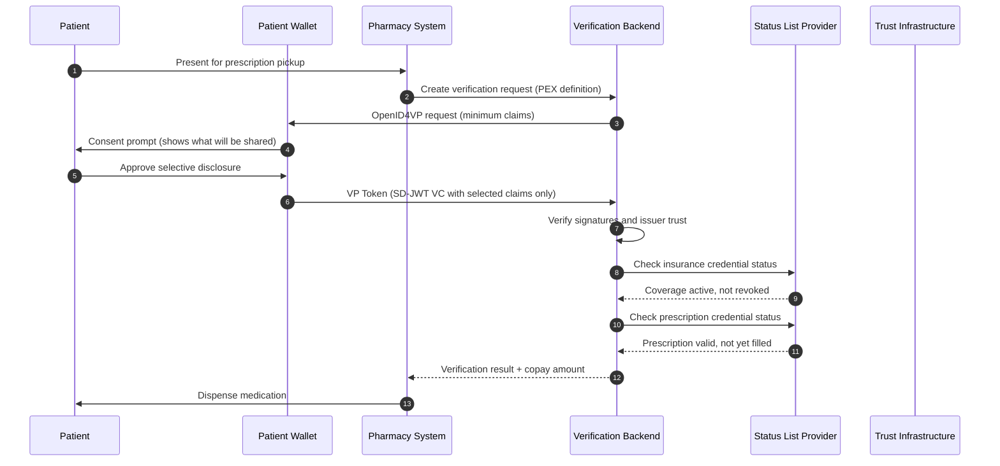
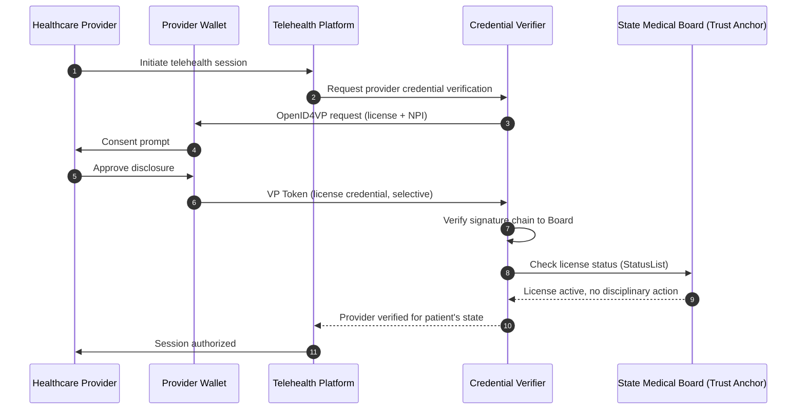
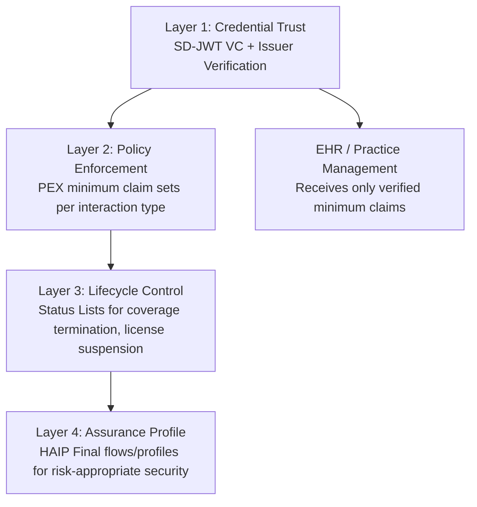

# Healthcare Credential Verification: Selective Disclosure for Patient Identity, Insurance, and Provider Trust

> **Quick Facts**
>
> |              |                                                                                                                                                               |
> | ------------ | ------------------------------------------------------------------------------------------------------------------------------------------------------------- |
> | Industry     | Healthcare / Health Insurance / Pharmacy                                                                                                                      |
> | Complexity   | High                                                                                                                                                          |
> | Key Packages | `SdJwt.Net.Vc`, `SdJwt.Net.Oid4Vp`, `SdJwt.Net.PresentationExchange`, `SdJwt.Net.StatusList`, `SdJwt.Net.HAIP`                                                |
> | Sample       | [PatientConsent.cs](https://github.com/openwallet-foundation-labs/sd-jwt-dotnet/tree/main/samples/SdJwt.Net.Samples/04-UseCases/Healthcare/PatientConsent.cs) |

## Executive summary

Healthcare data breaches are the most expensive across all industries, averaging **$9.77M per incident** in 2024 (IBM Cost of a Data Breach Report 2024). At the same time, HIPAA's "minimum necessary" standard requires covered entities to limit PHI disclosure to the minimum needed for a given purpose - a requirement that maps directly onto SD-JWT selective disclosure.

The practical problem: healthcare identity verification today relies on full-record lookups, photocopied insurance cards, and phone-based eligibility checks that expose far more data than any single interaction requires. Every unnecessary data field in a transaction is an additional breach surface.

SD-JWT VC provides a standards-based approach to solving this:

- Issue verifiable patient identity and insurance credentials with selective disclosure.
- Present only the claims required for a specific healthcare interaction.
- Verify provider credentials (DEA, NPI, board certifications) with cryptographic proof.
- Enforce credential lifecycle (suspension, revocation) for expired licenses or terminated coverage.

---

## In plain English

Healthcare involves many credential exchanges: patient identity at registration, insurance eligibility for billing, provider licenses for referrals, and prescription authority for pharmacy. Today, each exchange shares more data than necessary - a pharmacy sees the full insurance card when it only needs coverage status. SD-JWT VC enables each interaction to share only the minimum claims needed, supporting the HIPAA minimum necessary standard through technical controls rather than policy alone.

## What SD-JWT .NET provides

**Provides:** SD-JWT VC credential issuance and verification, selective disclosure for minimum necessary data sharing, status list management for credential revocation, and presentation exchange for structured disclosure policies.

**Does not provide:** HIPAA compliance certification, electronic health record (EHR) integration, clinical data standards (HL7/FHIR), or covered entity compliance assessments. The library supports minimum necessary technical controls; your organization's compliance program determines whether the implementation meets HIPAA requirements.

## Risks and limitations

- Selective disclosure supports minimum necessary technical controls but does not guarantee HIPAA compliance
- Healthcare credential ecosystems require trusted issuers (state licensing boards, insurance companies) that may not yet issue SD-JWT VC credentials
- Patient identity credentials require strong binding to prevent medical identity fraud
- Business outcomes listed are target improvements based on industry benchmarks

---

## 1) Why this matters now: healthcare identity is broken and expensive

### The cost of the current model

Healthcare identity verification failures create measurable harm:

- **$9.77M** average cost per healthcare data breach (IBM, 2024).
- **$100B+** estimated annual healthcare fraud in the US (National Health Care Anti-Fraud Association).
- **One in five patients** report errors in medical records due to identity mismatches (Ponemon Institute).
- **Medical identity theft** affects approximately 2.3 million Americans annually.

### Regulatory drivers

- **HIPAA Minimum Necessary Rule** (45 CFR 164.502(b)): covered entities must make reasonable efforts to limit PHI to the minimum necessary for the intended purpose. SD-JWT selective disclosure is a direct technical implementation of this principle.
- **HIPAA Security Rule**: requires technical safeguards for electronic PHI integrity and access controls.
- **21st Century Cures Act**: mandates patient access and interoperability, pushing toward portable digital credentials.
- **CMS Interoperability Rules (CMS-9115-F, CMS-0057-F)**: require payers to support standardized patient access APIs.
- **EU EHDS (European Health Data Space)**: enables cross-border health data exchange with privacy controls, aligning with EUDIW credential flows.

### Why current solutions fail

| Current approach          | What it exposes                   | The problem                                                       |
| ------------------------- | --------------------------------- | ----------------------------------------------------------------- |
| Insurance card photocopy  | Full member ID, group, plan, DOB  | Static artifact, no revocation, trivially copied                  |
| Phone eligibility check   | Full member record to call center | Over-disclosure to human operators, no audit trail                |
| HL7/FHIR identity lookup  | Full patient demographics bundle  | System-to-system disclosure of complete records                   |
| Portal-based verification | Username/password + full profile  | Credential stuffing risk, full profile exposure on authentication |

---

## 2) The solution pattern: verifiable healthcare credentials with minimum disclosure

### Core credentials

| Credential type                       | Issuer                         | Key claims (selectively disclosable)                                                    |
| ------------------------------------- | ------------------------------ | --------------------------------------------------------------------------------------- |
| Patient Identity Credential           | Government / Identity Provider | `name`, `date_of_birth`, `age_over_18`, `photo_hash`, `address_state`                   |
| Insurance Eligibility Credential      | Health Plan / Payer            | `member_id`, `plan_type`, `coverage_active`, `copay_tier`, `network`, `effective_date`  |
| Provider License Credential           | State Medical Board / DEA      | `npi`, `license_number`, `specialty`, `license_state`, `license_active`, `dea_schedule` |
| Immunization Record Credential        | Public Health Authority        | `vaccine_type`, `administration_date`, `lot_number`, `administering_provider`           |
| Prescription Authorization Credential | Prescribing Provider           | `medication_class`, `authorized_quantity`, `valid_through`, `prescriber_npi`            |

### Why selective disclosure matters here

**Scenario: Pharmacy filling a prescription**

What the pharmacy actually needs:

- Patient name (to match prescription)
- Insurance coverage active (yes/no)
- Copay tier (to calculate cost)
- Prescription authorization (valid, not expired)

What the pharmacy does NOT need:

- Patient date of birth (age flag sufficient)
- Patient home address
- Full insurance member ID
- Medical history or diagnosis codes
- Provider's DEA number (only that they hold one for the relevant schedule)

With SD-JWT VC, the patient presents only the required claims. The pharmacy verifies cryptographically without ever seeing the full record.

---

## 3) Reference architecture

### Diagram A: Pharmacy prescription verification flow

### Diagram B: Provider credential verification for telehealth

### Diagram C: Layered healthcare trust model

---

## 4) Interaction-specific disclosure policies

| Healthcare interaction       | Required claims                                                     | Optional claims                  | Never disclose to this system                |
| ---------------------------- | ------------------------------------------------------------------- | -------------------------------- | -------------------------------------------- |
| Pharmacy prescription pickup | `patient_name`, `coverage_active`, `copay_tier`, `rx_authorization` | `age_over_18`                    | Full DOB, address, diagnosis, SSN            |
| Emergency department triage  | `patient_name`, `age_band`, `allergies_flag`, `emergency_contact`   | `blood_type`, `insurance_status` | SSN, full medical history, financial data    |
| Telehealth session start     | `provider_npi`, `license_active`, `specialty`, `license_state`      | `board_certification`            | DEA number, home address, SSN                |
| Insurance pre-authorization  | `member_id`, `plan_type`, `procedure_code`, `provider_npi`          | `referring_provider`             | Patient diagnosis details, full demographics |
| Immunization record check    | `vaccine_type`, `administration_date`, `patient_name`               | `lot_number`                     | Full medical record, insurance details       |

---

## 5) How the SD-JWT .NET packages fit

| Healthcare requirement                        | Package(s)                                                                           | How it helps                                                                   |
| --------------------------------------------- | ------------------------------------------------------------------------------------ | ------------------------------------------------------------------------------ |
| Credential issuance with selective disclosure | [SdJwt.Net.Vc](../../src/SdJwt.Net.Vc/README.md)                                     | Issue patient/provider/insurance credentials with per-claim disclosure control |
| Minimum-claim verification requests           | [SdJwt.Net.PresentationExchange](../../src/SdJwt.Net.PresentationExchange/README.md) | Define interaction-specific claim requirements as PEX definitions              |
| Credential presentation protocol              | [SdJwt.Net.Oid4Vp](../../src/SdJwt.Net.Oid4Vp/README.md)                             | Standards-based wallet-to-verifier presentation flow                           |
| Coverage termination and license revocation   | [SdJwt.Net.StatusList](../../src/SdJwt.Net.StatusList/README.md)                     | Real-time credential lifecycle (insurance terminated, license suspended)       |
| High-assurance healthcare scenarios           | [SdJwt.Net.HAIP](../../src/SdJwt.Net.HAIP/README.md)                                 | Validate HAIP Final flows/profiles for regulated healthcare interactions       |

---

## 6) Business value

### Quantifiable outcomes

| Metric                                | Current state                                    | With verifiable credentials                          |
| ------------------------------------- | ------------------------------------------------ | ---------------------------------------------------- |
| Eligibility verification time         | 30-60 seconds (phone/API lookup)                 | Sub-second (cryptographic verification)              |
| Data exposed per pharmacy transaction | 15-20 fields (full member record)                | 3-5 fields (selective disclosure)                    |
| Insurance card fraud                  | No revocation, static artifacts                  | Real-time status checks, cryptographic binding       |
| Provider license verification         | Manual board website checks, days to confirm     | Instant cryptographic verification with status check |
| Breach blast radius                   | Full patient demographics per compromised record | Only disclosed claims per interaction                |
| HIPAA minimum necessary compliance    | Policy-based, difficult to audit                 | Technical enforcement with evidence receipts         |

### Cost reduction drivers

- Reduced eligibility verification call volume (estimated 20-40% of payer call center volume).
- Faster prior authorization workflows with pre-verified provider credentials.
- Lower breach costs through smaller data exposure per transaction.
- Reduced medical identity theft through cryptographic patient binding.

---

## 7) Implementation checklist

- Define credential schemas for patient identity, insurance, and provider licenses.
- Map each healthcare interaction type to a minimum claim set with PEX definitions.
- Implement status list integration for insurance termination and license suspension.
- Gate clinical system access behind credential verification and policy checks.
- Enforce freshness controls (`nonce`, `aud`, credential expiry) for each session.
- Store evidence receipts with claim hashes, issuer IDs, and verification timestamps for HIPAA audit trails.
- Apply HAIP profiles for high-assurance interactions (controlled substance prescriptions, surgery authorization).
- Define incident playbooks for compromised issuer keys and revoked provider credentials.

---

## Related use cases

| Use Case                                        | Relationship                                                   |
| ----------------------------------------------- | -------------------------------------------------------------- |
| [Automated Compliance](automated-compliance.md) | Foundation - policy-first disclosure governance                |
| [Incident Response](incident-response.md)       | Complementary - provider credential compromise containment     |
| [Financial AI](financial-ai.md)                 | Pattern alignment - verified context gate for AI in healthcare |

---

## Public references

- IBM Cost of a Data Breach Report 2024: <https://newsroom.ibm.com/2024-07-30-ibm-report-escalating-data-breach-disruption-pushes-costs-to-new-highs>
- HIPAA Minimum Necessary Rule (45 CFR 164.502(b)): <https://www.hhs.gov/hipaa/for-professionals/privacy/guidance/minimum-necessary-requirement/index.html>
- 21st Century Cures Act: <https://healthit.gov/legislation/>
- CMS Interoperability and Patient Access Rules: <https://www.cms.gov/priorities/key-initiatives/burden-reduction/interoperability>
- European Health Data Space (EHDS): <https://health.ec.europa.eu/ehealth-digital-health-and-care/european-health-data-space_en>
- RFC 9901 (SD-JWT): <https://www.rfc-editor.org/rfc/rfc9901.html>
- OpenID4VP 1.0: <https://openid.net/specs/openid-4-verifiable-presentations-1_0.html>

---

_Disclaimer: This article is informational and not legal or medical advice. For regulated healthcare deployments, validate obligations with your compliance teams, legal counsel, and the latest HIPAA/EHDS guidance._
