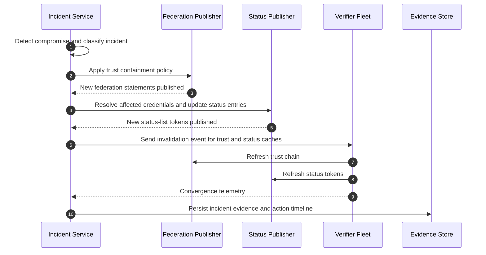
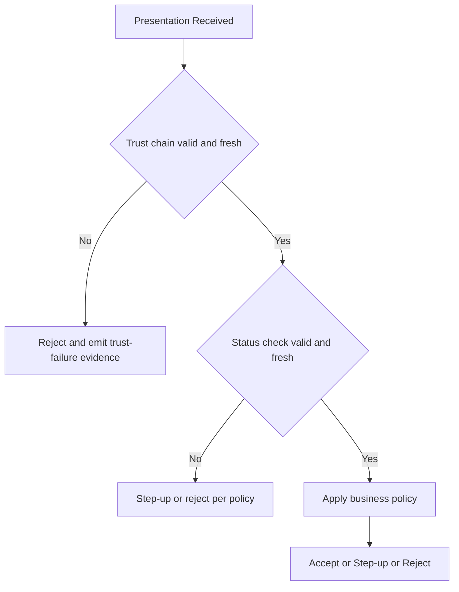

# Incident Response for Credential Ecosystems: Automated Trust Containment with Federation and Status Lists

> **Quick Facts**
>
> | | |
> |---|---|
> | Industry | Security Operations (Cross-industry) |
> | Complexity | High |
> | Key Packages | `SdJwt.Net.OidFederation`, `SdJwt.Net.StatusList`, `SdJwt.Net.HAIP` |
> | Sample | [IncidentResponseScenario.cs](../../samples/SdJwt.Net.Samples/RealWorld/Advanced/IncidentResponseScenario.cs) |

## Executive summary

The highest-impact credential incident is issuer key compromise. An attacker can issue cryptographically valid but fraudulent credentials until verifiers stop trusting the compromised issuer path.

Manual response is too slow for this failure mode. A production response requires two coordinated containment planes:

- **Trust containment**: update federation trust state so verifiers reject compromised chains.
- **Lifecycle containment**: revoke or suspend affected credentials through status lists.

This article provides a workflow-centric response model, implementation guidance with sd-jwt-dotnet components, and the evidence artifacts needed for audits and post-incident review.

---

## 1) Why this matters: containment time drives impact

Credential incidents are not binary; impact scales with elapsed time.

- Longer containment windows increase acceptance of fraudulent artifacts.
- Inconsistent verifier cache behavior creates uneven exposure.
- Missing evidence artifacts delay recovery and regulator communication.

A practical target is to minimize:

1. **Time to trust containment** (federation policy propagation).
2. **Time to lifecycle containment** (status update visibility).
3. **Time to verifier convergence** (cache refresh and fail-closed behavior).

---

## 2) Current solutions and why they fail under pressure

Common enterprise response patterns today:

- Ticket-driven revocation and trust updates.
- Periodic verifier metadata refresh without incident-triggered invalidation.
- Manual incident timelines assembled from fragmented logs.

These approaches break in high-speed compromise scenarios:

- Human latency extends exposure windows.
- Partial cache refresh creates inconsistent verifier behavior.
- Incomplete evidence slows regulator, legal, and customer communications.

Evidence points:

- NIST SP 800-61r3 emphasizes coordinated preparation, analysis, containment, and recovery workflows with measurable process maturity.
- CISA's Oracle cloud compromise advisory highlights how credential theft can lead to broad downstream impact when response is not immediate and coordinated.

---

## 3) Incident classes and containment goals

| Incident class                     | Primary containment action                                                      | Evidence priority                               |
| ---------------------------------- | ------------------------------------------------------------------------------- | ----------------------------------------------- |
| Issuer signing key compromise      | Revoke or disable issuer trust path; revoke affected credentials                | Chain resolution result, affected scope mapping |
| Status signing key compromise      | Rotate status key, republish trusted metadata, freeze affected status decisions | Token signature validation evidence             |
| Federation anchor policy error     | Roll back policy version and republish statements                               | Policy version history, rollback evidence       |
| Verifier cache poisoning/staleness | Force invalidation and fail-closed for stale trust/status state                 | Cache invalidation event logs                   |

---

## 4) End-to-end containment workflow



### Operational flow details

1. **Detect and classify**: identify incident type and blast radius.
2. **Freeze risky paths**: temporarily block high-risk operations where needed.
3. **Contain trust**: sever or constrain compromised federation entities.
4. **Contain lifecycle**: revoke/suspend affected credentials via status updates.
5. **Invalidate caches**: trigger verifier-side trust/status refresh.
6. **Observe convergence**: measure how fast verifier fleet reaches safe state.
7. **Record evidence**: persist immutable action and decision artifacts.

---

## 5) Verifier behavior during active incidents



Verifier controls that should be explicit:

- Short TTLs for trust and status caches in high-assurance environments.
- Support for explicit invalidation events.
- Fail-closed defaults for unresolved trust/status state in abuse-sensitive flows.
- Structured reason codes for each reject or step-up decision.

---

## 6) Evidence artifacts for post-incident defensibility

### Minimum evidence receipt fields

- `incident_id`
- `incident_class`
- `containment_policy_version`
- `affected_entity_ids`
- `affected_credential_scope`
- `federation_statement_hash_before` and `after`
- `status_list_token_hash_before` and `after`
- `cache_invalidation_event_id`
- `verifier_convergence_metrics`
- `operator_or_service_identity`
- `timestamp_utc`

### Why this matters

These artifacts support:

- Internal root-cause analysis.
- External audit and regulator responses.
- Controlled recovery and trust restoration.

---

## 7) How the SD-JWT ecosystem helps resolve this

### When to apply this response model

Use this full model when:

- You operate in a multi-issuer or federated trust environment.
- Credential misuse can create high-impact business or regulatory events.
- You need coordinated trust containment and lifecycle containment.
- You must prove containment timelines and decision quality after incidents.

For smaller ecosystems, you can start with status-based containment and add federation automation as issuer count and trust complexity increase.

### How the packages work together

| Incident phase                   | Package(s)                                                                                                                                             | How it helps                                                                                  |
| -------------------------------- | ------------------------------------------------------------------------------------------------------------------------------------------------------ | --------------------------------------------------------------------------------------------- |
| Trust containment                | [SdJwt.Net.OidFederation](../../src/SdJwt.Net.OidFederation/README.md)                                                                                 | Republishes updated trust statements so compromised entities are no longer accepted.          |
| Lifecycle containment            | [SdJwt.Net.StatusList](../../src/SdJwt.Net.StatusList/README.md)                                                                                       | Marks affected credentials revoked/suspended and enables verifier-side lifecycle enforcement. |
| Verifier enforcement             | [SdJwt.Net.Vc](../../src/SdJwt.Net.Vc/README.md), [SdJwt.Net.Oid4Vp](../../src/SdJwt.Net.Oid4Vp/README.md), [SdJwt.Net](../../src/SdJwt.Net/README.md) | Ensures trust/status outcomes are applied during presentation verification and decisioning.   |
| High-assurance gating (optional) | [SdJwt.Net.HAIP](../../src/SdJwt.Net.HAIP/README.md)                                                                                                   | Tightens policy gates and fail-closed behavior for high-risk operations.                      |

### Practical containment sequence

1. Detect incident and classify blast radius.
2. Apply federation trust containment.
3. Apply status-list containment for affected credentials.
4. Invalidate verifier trust/status caches and force refresh.
5. Enforce fail-closed or step-up on uncertain trust/status outcomes.
6. Persist incident evidence artifacts for audits and recovery governance.

### Relevant samples

- [IncidentResponseScenario.cs](../../samples/SdJwt.Net.Samples/RealWorld/Advanced/IncidentResponseScenario.cs)
- [OpenIdFederationExample.cs](../../samples/SdJwt.Net.Samples/Standards/OpenId/OpenIdFederationExample.cs)
- [StatusListExample.cs](../../samples/SdJwt.Net.Samples/Standards/VerifiableCredentials/StatusListExample.cs)
- [OpenId4VpExample.cs](../../samples/SdJwt.Net.Samples/Standards/OpenId/OpenId4VpExample.cs)

These are building blocks. Incident orchestration, SIEM integration, and paging workflows remain application responsibilities.

---

## 8) Reference orchestration workflow (application layer)

```csharp
// Illustrative incident orchestration service.
public async Task HandleIssuerKeyCompromiseAsync(string issuerEntityId, CancellationToken ct)
{
    var incident = await _incidentStore.StartAsync("issuer_key_compromise", issuerEntityId, ct);

    // 1) Trust containment
    await _federationPolicy.MarkEntityCompromisedAsync(issuerEntityId, ct);
    var federationPublish = await _federationPublisher.PublishAsync(ct);

    // 2) Status containment
    var affectedCredentials = await _credentialIndex.FindByIssuerAsync(issuerEntityId, ct);
    await _statusWorkflow.RevokeAsync(affectedCredentials, ct);
    var statusPublish = await _statusWorkflow.PublishAsync(ct);

    // 3) Verifier convergence
    var invalidationEventId = await _cacheBus.PublishInvalidationAsync(issuerEntityId, ct);
    var convergence = await _fleetTelemetry.WaitForConvergenceAsync(invalidationEventId, ct);

    // 4) Immutable evidence
    await _evidenceStore.WriteAsync(new IncidentEvidence
    {
        IncidentId = incident.Id,
        FederationPublishId = federationPublish.Id,
        StatusPublishId = statusPublish.Id,
        CacheInvalidationEventId = invalidationEventId,
        ConvergencePercent = convergence.Percent
    }, ct);
}
```

---

## 9) Drill model and SLOs

Suggested operational SLOs:

- Time to trust containment publication.
- Time to status containment publication.
- Time to 95% verifier cache convergence.
- Evidence completeness rate per incident.

Run controlled drills quarterly with these outputs:

- Planned vs observed containment timings.
- Verifier divergence analysis.
- Recovery playbook updates.

---

## Public references (URLs)

- OpenID Federation 1.0: <https://openid.net/specs/openid-federation-1_0.html>
- OAuth Token Status List draft: <https://datatracker.ietf.org/doc/draft-ietf-oauth-status-list/>
- SD-JWT VC draft: <https://datatracker.ietf.org/doc/draft-ietf-oauth-sd-jwt-vc/>
- RFC 9901 (SD-JWT): <https://www.rfc-editor.org/rfc/rfc9901.html>
- NIST SP 800-61r3 (Incident Response Recommendations and Considerations for Cybersecurity Risk Management): <https://csrc.nist.gov/pubs/sp/800/61/r3/final>
- CISA advisory on Oracle cloud compromise activity: <https://www.cisa.gov/news-events/cybersecurity-advisories/aa25-094a>

---

## Related Use Cases

| Use Case | Relationship |
|----------|-------------|
| [Automated Compliance](automated-compliance.md) | Complementary - prevention before incidents |
| [Post-Quantum Readiness](quantum-key-distribution.md) | Complementary - key compromise migration |
| [Telecom eSIM](telco-esim.md) | Application - fraud containment in telecom |

_Disclaimer: This article is informational and not legal advice. For regulated deployments, validate obligations with your legal/compliance teams and the latest official guidance._
