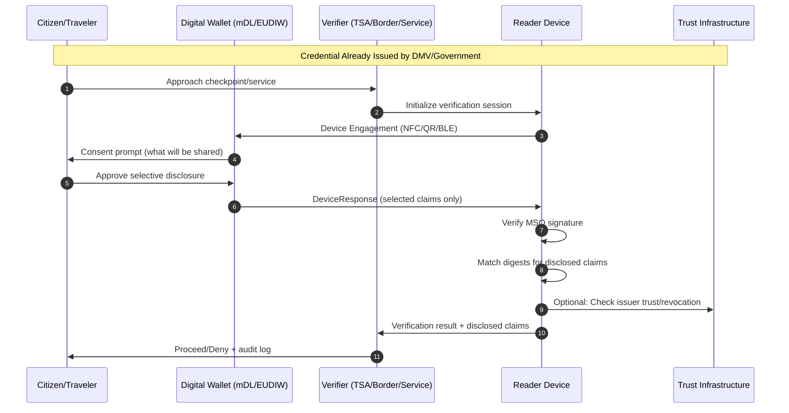
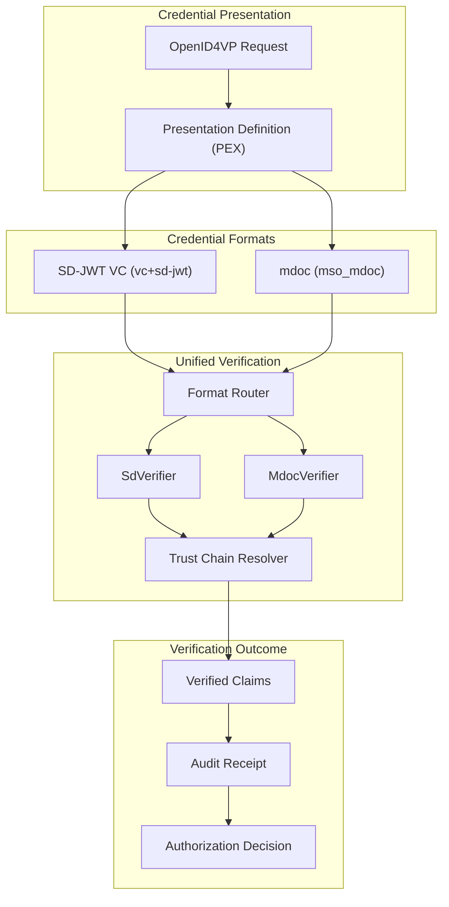
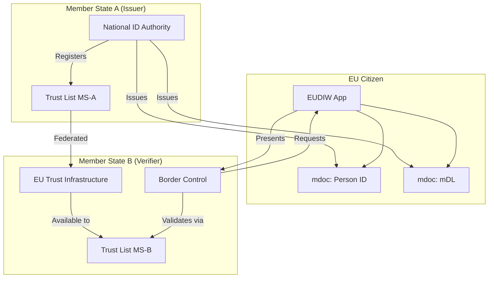

# Mobile Identity Verification with mdoc: From TSA Checkpoints to Cross-Border Travel

> **Quick Facts**
>
> |              |                                                                                                                                                                                 |
> | ------------ | ------------------------------------------------------------------------------------------------------------------------------------------------------------------------------- |
> | Industry     | Government / Travel / Identity Verification                                                                                                                                     |
> | Complexity   | High                                                                                                                                                                            |
> | Key Packages | `SdJwt.Net.Mdoc`, `SdJwt.Net.Oid4Vp`, `SdJwt.Net.HAIP`, `SdJwt.Net.PresentationExchange`                                                                                        |
> | Sample       | [MdocIdentityVerification.cs](https://github.com/openwallet-foundation-labs/sd-jwt-dotnet/tree/main/samples/SdJwt.Net.Samples/04-UseCases/Identity/MdocIdentityVerification.cs) |

## Executive Summary

ISO 18013-5 mobile documents (mdoc) are becoming the global standard for digital identity credentials. From mobile driving licenses (mDL) in the United States to the EU Digital Identity Wallet (EUDIW), governments worldwide are adopting this compact, privacy-preserving credential format for citizen identity.

This creates a practical opportunity: mdoc credentials enable secure, offline-capable identity verification that protects citizen privacy while meeting regulatory requirements. The SD-JWT .NET ecosystem provides a complete implementation of mdoc alongside SD-JWT VC, enabling verifiers to accept both credential formats through unified OpenID4VP flows.

Key capabilities:

- **Offline verification**: CBOR-based format works without network connectivity
- **Selective disclosure**: Citizens reveal only required attributes (age flag, not birthdate)
- **Device binding**: Cryptographic proof the credential belongs to the presenter
- **HAIP compliance**: Meets high assurance requirements for government credentials
- **Cross-format support**: Same verification flow for mdoc and SD-JWT VC

---

## 1) Why This Matters Now: Digital Identity Infrastructure is Scaling

Digital identity credentials are moving from pilot to production:

**United States**:

- AAMVA (American Association of Motor Vehicle Administrators) has published mDL Implementation Guidelines
- States including Utah, Colorado, Arizona, Louisiana are issuing production mDLs
- TSA accepts mDL at participating airports via CAT (Credential Authentication Technology) readers
- Apple Wallet and Google Wallet support mDL storage

**European Union**:

- eIDAS 2.0 regulation (2024/1183) mandates EUDIW adoption by 2026
- Architecture Reference Framework (ARF) specifies mdoc as a supported format
- Large-Scale Pilots (LSPs) testing cross-border credential exchange

**International**:

- ISO 18013-7 defines international verification protocols
- ICAO exploring mDL linkage with travel documents
- Australia, Japan, Korea advancing mDL programs

The key implication: identity verifiers need to accept mdoc credentials now, and the verification infrastructure must handle both mdoc and SD-JWT VC formats.

---

## 2) The Architecture Pattern: Unified Multi-Format Verification

### Diagram A: Complete Identity Verification Flow



What this architecture enforces:

- Citizen consents before any data leaves the wallet
- Only selected claims are transmitted (not the full credential)
- Cryptographic verification works offline (online trust check optional)
- Audit trail maintains what was verified, not what was disclosed but not requested

### Diagram B: Multi-Format Verifier Architecture



Scope note: The SD-JWT .NET ecosystem provides the format-specific verifiers (SdVerifier, MdocVerifier), presentation exchange evaluation, OpenID4VP protocol handling, and HAIP compliance validation. Application-layer components (consent UI, audit storage, device engagement) are implementation-specific.

---

## 3) End-to-End Example: TSA Airport Checkpoint

This is a realistic US scenario: a traveler uses their state-issued mDL at a TSA checkpoint.

### 1. Traveler Approaches Checkpoint

The TSA officer instructs the traveler to present identification. The checkpoint has a CAT reader with both camera and NFC capability.

### 2. Device Engagement

The traveler taps their phone on the NFC reader, or the wallet displays a QR code scanned by the reader:

```csharp
using SdJwt.Net.Mdoc.Handover;

// Reader initiates session
var sessionId = Guid.NewGuid().ToString();
var nonce = GenerateCryptographicNonce();

// For same-device flow (QR displayed on reader screen)
var authorizationRequest = new AuthorizationRequest
{
    ClientId = "https://tsa.gov/checkpoint/SEA-01",
    ResponseUri = $"https://tsa.gov/verify/{sessionId}",
    Nonce = nonce,
    PresentationDefinition = CreateMdlVerificationRequest()
};
```

### 3. Presentation Definition (What TSA Requests)

```csharp
using SdJwt.Net.PresentationExchange;

var presentationDefinition = new PresentationDefinition
{
    Id = "tsa-identity-verification",
    Purpose = "Verify identity for TSA checkpoint access",
    InputDescriptors = new[]
    {
        new InputDescriptor
        {
            Id = "mdl-identity",
            Format = new Dictionary<string, object>
            {
                ["mso_mdoc"] = new { alg = new[] { "ES256", "ES384" } }
            },
            Constraints = new Constraints
            {
                LimitDisclosure = "required",
                Fields = new[]
                {
                    // Required: Photo for visual match
                    new Field
                    {
                        Path = new[] { "$['org.iso.18013.5.1']['portrait']" },
                        IntentToRetain = false
                    },
                    // Required: Name
                    new Field
                    {
                        Path = new[] { "$['org.iso.18013.5.1']['family_name']" },
                        IntentToRetain = false
                    },
                    new Field
                    {
                        Path = new[] { "$['org.iso.18013.5.1']['given_name']" },
                        IntentToRetain = false
                    },
                    // Required: Document validity
                    new Field
                    {
                        Path = new[] { "$['org.iso.18013.5.1']['expiry_date']" }
                    }
                }
            }
        }
    }
};
```

### 4. Wallet Creates Selective Presentation

The wallet shows the traveler exactly what will be shared:

- Portrait photo
- Family name
- Given name
- Expiry date

The wallet does NOT include: address, birthdate, document number, driving privileges.

```csharp
using SdJwt.Net.Mdoc.Models;

// Wallet filters to only requested elements
var selectedElements = new[] { "portrait", "family_name", "given_name", "expiry_date" };

var presentation = CreateSelectivePresentation(
    mdoc: travelerMdl,
    requestedElements: selectedElements);

// Create session transcript for binding
var transcript = SessionTranscript.ForOpenId4Vp(
    clientId: authRequest.ClientId,
    nonce: authRequest.Nonce,
    mdocGeneratedNonce: GenerateDeviceNonce(),
    responseUri: authRequest.ResponseUri);

// Package as DeviceResponse
var deviceResponse = new DeviceResponse
{
    Version = "1.0",
    Documents = new List<Document> { presentation },
    Status = 0
};
```

### 5. Reader Verifies Presentation

```csharp
using SdJwt.Net.Mdoc.Verifier;

public class TsaVerificationService
{
    private readonly MdocVerifier _verifier = new();
    private readonly ITrustResolver _trustResolver;

    public async Task<VerificationOutcome> VerifyMdlAsync(
        byte[] presentationBytes,
        string expectedNonce)
    {
        var response = DeviceResponse.FromCbor(presentationBytes);

        if (response.Status != 0)
            return VerificationOutcome.DeviceError(response.Status);

        foreach (var doc in response.Documents)
        {
            // Verify document structure and signature
            var options = new MdocVerificationOptions
            {
                ValidateExpiry = true,
                ExpectedDocType = "org.iso.18013.5.1.mDL"
            };

            var result = _verifier.Verify(doc, options);

            if (!result.IsValid)
                return VerificationOutcome.Failed(result.Error);

            // Optional: Check issuer against trusted issuers
            var issuerValid = await _trustResolver.ValidateIssuerAsync(
                doc.IssuerSigned.IssuerAuth);

            if (!issuerValid)
                return VerificationOutcome.UntrustedIssuer();

            // Extract verified claims for officer display
            return VerificationOutcome.Success(result.VerifiedClaims);
        }

        return VerificationOutcome.NoDocuments();
    }
}
```

### 6. Officer Review and Decision

The CAT reader displays:

- Verified photo (officer compares to traveler)
- Name: "Alice Johnson"
- Status: "Credential Valid"
- Expiry: "2029-03-01"

The officer visually matches the photo, confirms the name, and allows the traveler to proceed.

---

## 4) Cross-Border Scenario: EUDIW at Border Control

This scenario demonstrates mdoc verification at an EU border crossing.

### Architecture for Cross-Border



### Implementation

```csharp
public class EuBorderVerificationService
{
    private readonly MdocVerifier _mdocVerifier = new();
    private readonly IEuTrustListClient _trustList;

    public async Task<BorderCheckResult> VerifyTravelerAsync(
        DeviceResponse response,
        string expectedNonce)
    {
        var results = new List<DocumentVerification>();

        foreach (var doc in response.Documents)
        {
            // Verify the document
            var verifyResult = _mdocVerifier.Verify(doc, new MdocVerificationOptions
            {
                ValidateExpiry = true
            });

            if (!verifyResult.IsValid)
            {
                results.Add(DocumentVerification.Failed(doc.DocType, verifyResult.Error));
                continue;
            }

            // Validate issuer against EU trust list
            var issuerCert = ExtractIssuerCertificate(doc.IssuerSigned.IssuerAuth);
            var trustResult = await _trustList.ValidateIssuerAsync(
                issuerCert,
                doc.DocType);

            if (!trustResult.IsTrusted)
            {
                results.Add(DocumentVerification.UntrustedIssuer(doc.DocType));
                continue;
            }

            results.Add(DocumentVerification.Success(
                doc.DocType,
                verifyResult.VerifiedClaims,
                trustResult.IssuerCountry));
        }

        return new BorderCheckResult
        {
            AllValid = results.All(r => r.IsValid),
            Documents = results,
            Timestamp = DateTimeOffset.UtcNow,
            CheckpointId = "FR-CDG-T2-01"
        };
    }
}
```

---

## 5) Multi-Credential Scenario: Car Rental Service

A car rental company needs to verify:

1. Driver's license (mdoc mDL)
2. Proof of insurance (SD-JWT VC)
3. Payment method (SD-JWT VC)

### Unified Presentation Request

```csharp
var presentationDefinition = new PresentationDefinition
{
    Id = "car-rental-verification",
    Purpose = "Verify driver eligibility for vehicle rental",
    InputDescriptors = new[]
    {
        // mdoc: Driver's License
        new InputDescriptor
        {
            Id = "drivers-license",
            Format = new Dictionary<string, object>
            {
                ["mso_mdoc"] = new { alg = new[] { "ES256" } }
            },
            Constraints = new Constraints
            {
                Fields = new[]
                {
                    new Field { Path = new[] { "$['org.iso.18013.5.1']['family_name']" } },
                    new Field { Path = new[] { "$['org.iso.18013.5.1']['given_name']" } },
                    new Field { Path = new[] { "$['org.iso.18013.5.1']['driving_privileges']" } },
                    new Field { Path = new[] { "$['org.iso.18013.5.1']['age_over_21']" } }
                }
            }
        },
        // SD-JWT VC: Insurance
        new InputDescriptor
        {
            Id = "insurance-proof",
            Format = new Dictionary<string, object>
            {
                ["vc+sd-jwt"] = new { alg = new[] { "ES256" } }
            },
            Constraints = new Constraints
            {
                Fields = new[]
                {
                    new Field
                    {
                        Path = new[] { "$.vct" },
                        Filter = new Filter { Const = "InsuranceCredential" }
                    },
                    new Field { Path = new[] { "$.coverage_type" } },
                    new Field { Path = new[] { "$.coverage_amount" } }
                }
            }
        }
    }
};
```

### Multi-Format Verification

```csharp
public class CarRentalVerificationService
{
    private readonly MdocVerifier _mdocVerifier = new();
    private readonly SdVerifier _sdJwtVerifier;

    public async Task<RentalEligibility> VerifyCustomerAsync(
        VpTokenResponse response)
    {
        var eligibility = new RentalEligibility();

        foreach (var vpToken in response.Tokens)
        {
            if (vpToken.Format == "mso_mdoc")
            {
                // Verify mdoc
                var mdocBytes = Convert.FromBase64String(vpToken.Token);
                var doc = Document.FromCbor(mdocBytes);
                var result = _mdocVerifier.Verify(doc, new MdocVerificationOptions());

                if (result.IsValid)
                {
                    eligibility.DriverName = $"{result.VerifiedClaims["given_name"]} {result.VerifiedClaims["family_name"]}";
                    eligibility.DrivingPrivileges = result.VerifiedClaims["driving_privileges"];
                    eligibility.AgeVerified = (bool)result.VerifiedClaims["age_over_21"];
                }
            }
            else if (vpToken.Format == "vc+sd-jwt")
            {
                // Verify SD-JWT VC
                var sdResult = await _sdJwtVerifier.VerifyAsync(
                    vpToken.Token,
                    _validationParams);

                if (sdResult.IsValid)
                {
                    var claims = sdResult.ClaimsPrincipal.Claims;
                    eligibility.InsuranceCoverage = claims
                        .FirstOrDefault(c => c.Type == "coverage_type")?.Value;
                }
            }
        }

        eligibility.IsEligible =
            eligibility.AgeVerified &&
            eligibility.DrivingPrivileges != null &&
            eligibility.InsuranceCoverage != null;

        return eligibility;
    }
}
```

---

## 6) What Success Looks Like (Measurable Outcomes)

A credible identity verification deployment is measured by operational metrics:

| Metric               | Target                    | Measurement                |
| -------------------- | ------------------------- | -------------------------- |
| Verification time    | < 3 seconds offline       | Reader device timing       |
| Privacy compliance   | 100% selective disclosure | Audit log analysis         |
| False rejection rate | < 0.1%                    | Valid credentials rejected |
| Device compatibility | 95%+ wallet support       | Interoperability testing   |
| Trust validation     | 100% issuer checks        | Trust list coverage        |

Key outcomes:

- Reduced manual document inspection time
- Eliminated photocopying of physical documents
- Improved citizen privacy (no over-disclosure)
- Cryptographic audit trail for compliance
- Interoperability across issuers and verifiers

---

## 7) Developer Implementation Checklist

- [ ] Define presentation requirements per use case (PEX input descriptors)
- [ ] Implement format routing for mdoc and SD-JWT VC
- [ ] Configure trust resolver for accepted issuers
- [ ] Implement consent UI showing exactly what will be disclosed
- [ ] Store verification audit receipts (claims verified, not values)
- [ ] Test offline verification (no network latency in critical path)
- [ ] Validate HAIP compliance (ES256+ algorithms only)
- [ ] Handle DeviceResponse error codes gracefully
- [ ] Implement session timeout and nonce expiry

---

## Closing

Mobile identity credentials are transforming how citizens interact with government services, travel infrastructure, and commercial verification. The mdoc format (ISO 18013-5) provides a compact, privacy-preserving, offline-capable credential that is being adopted globally.

The SD-JWT .NET ecosystem provides production-ready mdoc support alongside SD-JWT VC, enabling verifiers to accept both formats through unified OpenID4VP flows. This dual-format capability is essential as different jurisdictions and use cases adopt different credential formats.

For enterprises building identity verification systems: mdoc is not a future technology. States are issuing mDLs today, airlines are accepting them, and the EU is mandating EUDIW support. The time to implement is now.

---

## Related Use Cases

| Use Case                                         | Relationship                     |
| ------------------------------------------------ | -------------------------------- |
| [Cross-Border Government](crossborder.md)        | Foundation - EU OOTS integration |
| [Financial AI](financial-ai.md)                  | Complementary - KYC verification |
| [Retail E-Commerce](retail-ecommerce-returns.md) | Application - age verification   |

---

## Public References

Standards and Specifications

- ISO 18013-5:2021 Mobile driving licence (mDL): <https://www.iso.org/standard/69084.html>
- OpenID4VP specification: <https://openid.net/specs/openid-4-verifiable-presentations-1_0.html>
- OpenID4VC HAIP: <https://openid.net/specs/openid4vc-high-assurance-interoperability-profile-1_0.html>

Government Programs

- AAMVA mDL Implementation Guidelines: <https://www.aamva.org/mDL/>
- EU Digital Identity Wallet ARF: <https://digital-strategy.ec.europa.eu/en/library/european-digital-identity-wallet-architecture-and-reference-framework>
- TSA CAT Verification: <https://www.tsa.gov/travel/frequently-asked-questions/does-tsa-accept-mobile-drivers-licenses-mdls>

Industry

- Apple Wallet mDL: <https://support.apple.com/en-us/HT212940>
- Google Wallet Digital ID: <https://support.google.com/wallet/answer/12059089>

_Disclaimer: This article is informational and not legal advice. For regulated deployments, validate obligations with your legal/compliance teams and the latest official guidance._
