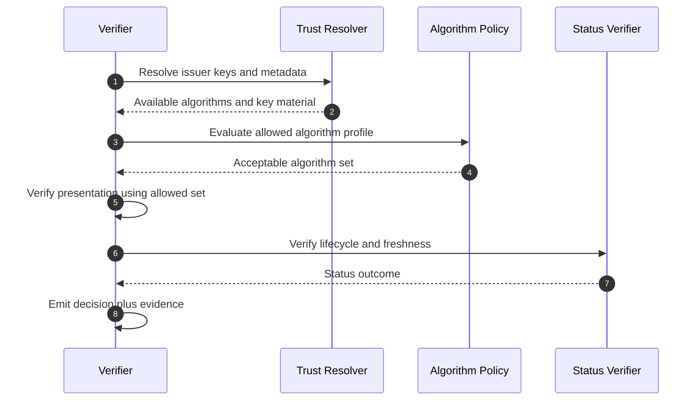

# Post-Quantum Readiness for Sovereign Identity: QKD, PQC, and SD-JWT Trust Infrastructure

> **Quick Facts**
>
> |              |                                                                                                                                                          |
> | ------------ | -------------------------------------------------------------------------------------------------------------------------------------------------------- |
> | Industry     | Security Architecture / Critical Infrastructure                                                                                                          |
> | Complexity   | High                                                                                                                                                     |
> | Key Packages | `SdJwt.Net.HAIP`, `SdJwt.Net.OidFederation`, `SdJwt.Net.StatusList`                                                                                      |
> | Sample       | [02-HaipCompliance.cs](https://github.com/openwallet-foundation-labs/sd-jwt-dotnet/tree/main/samples/SdJwt.Net.Samples/03-Advanced/02-HaipCompliance.cs) |

## Executive summary

Identity systems have long-lived trust artifacts: issuer keys, federation statements, and verification records. That makes them sensitive to "harvest now, decrypt later" and delayed signature-break risks.

A practical post-quantum strategy is not "flip everything to PQC tomorrow." It is a controlled migration program:

- Strengthen current controls (shorter validity, faster key rotation, strict freshness).
- Build algorithm agility into trust and verification policy.
- Pilot PQC in bounded domains with measurable interoperability outcomes.
- Use QKD only where threat model and operational constraints justify dedicated links.

This article explains a workflow-oriented migration model, evidence requirements, and how sd-jwt-dotnet components can be used in that program.

---

## 1) Why this matters for credential ecosystems

Credential ecosystems are exposed across multiple timescales:

- **Immediate risk**: key theft, stale trust, weak operational rotation.
- **Medium-term risk**: inconsistent migration across issuers and verifiers.
- **Long-term risk**: cryptanalytic improvements affecting historical artifacts.

For high-assurance deployments, readiness means reducing exposure now while preparing migration paths that do not break interoperability.

---

## 2) Current solutions and their limits

Most organizations currently rely on classical hardening controls:

- Stronger current-generation algorithms and key sizes.
- Faster key rotation and shorter token lifetimes.
- Better trust metadata refresh and cache freshness controls.

These are necessary controls, but they do not fully solve asymmetric migration risk:

- They reduce immediate exposure but do not remove future algorithm obsolescence risk.
- They do not provide a structured path for cross-ecosystem interoperability during transition.
- They often omit clear rollback and evidence strategies for mixed-algorithm verification periods.

Evidence points:

- NIST released the first post-quantum cryptography standards in 2024, confirming migration is an active standards transition, not a theoretical discussion.
- NSA CNSA 2.0 guidance sets explicit planning expectations for post-quantum transition in high-assurance environments.

---

## 3) What to protect and for how long

| Asset                    | Typical exposure concern                          | Control priority                                   |
| ------------------------ | ------------------------------------------------- | -------------------------------------------------- |
| Issuer signing keys      | Credential forgery and long-lived signature trust | Fast rotation, strict issuer trust policy          |
| Federation signing keys  | Compromised trust chains and policy abuse         | Anchor governance, statement freshness             |
| Status-list signing keys | False lifecycle state and replay windows          | Signature isolation and rapid republish            |
| Verification evidence    | Long retention and future cryptanalytic review    | Strong hashing, chain-of-custody, retention policy |

---

## 4) Migration workflow: crypto agility to PQC adoption

### Phase guidance

1. **Phase 0 - Reduce current exposure**
   - Shorten credential and metadata validity for high-risk flows.
   - Increase rotation cadence and trust refresh automation.
2. **Phase 1 - Build agility**
   - Externalize algorithm policy and verifier acceptance rules.
   - Keep transport and policy layers independent from algorithm hardcoding.
3. **Phase 2 - Dual-stack pilots**
   - Validate interoperability in staging and limited production segments.
   - Track fallback behavior and decision determinism.
4. **Phase 3 - Controlled rollout**
   - Expand PQC coverage by issuer cohort and verifier trust domain.
   - Maintain explicit rollback policy.
5. **Phase 4 - Optional QKD scope**
   - Apply only to justified bilateral links with dedicated infrastructure.

---

## 5) Verification workflow during algorithm transition

Key rule: algorithm transition must be policy-driven and explainable, never implicit.

---

## 6) Evidence model for migration assurance

You need evidence both for operational confidence and governance review.

Minimum artifacts:

- `algorithm_policy_version`
- `issuer_algorithm_profile`
- `verifier_allowed_algorithm_set`
- `trust_chain_hash`
- `verification_outcome`
- `fallback_path_used`
- `status_verification_outcome`
- `correlation_id` and timestamp

Suggested review table:

| Review objective                       | Evidence artifact                            |
| -------------------------------------- | -------------------------------------------- |
| Prove policy-controlled transition     | Policy version and decision logs             |
| Detect unsafe fallback                 | Fallback counters and reason codes           |
| Confirm trust freshness                | Trust-chain resolution timestamp and hash    |
| Confirm lifecycle control is unchanged | Status verification evidence across phases   |
| Demonstrate rollout quality            | Interoperability pass/fail metrics by cohort |

---

## 7) How the SD-JWT ecosystem helps resolve this

### When to apply this migration approach

Use this approach when:

- Credentials or trust artifacts have long retention windows.
- You need policy-controlled algorithm transitions across multiple parties.
- You cannot tolerate opaque fallback behavior during algorithm migration.
- You need auditable evidence for migration decisions and interoperability posture.

If your environment is early-stage, start with algorithm agility and evidence capture before attempting broad PQC rollout.

### How the packages work together

| Migration concern                                        | Package(s)                                                                                   | How it helps                                                                             |
| -------------------------------------------------------- | -------------------------------------------------------------------------------------------- | ---------------------------------------------------------------------------------------- |
| Stable SD-JWT/VC verification pipeline during transition | [SdJwt.Net](../../src/SdJwt.Net/README.md), [SdJwt.Net.Vc](../../src/SdJwt.Net.Vc/README.md) | Keeps selective-disclosure verification stable while algorithm policy evolves around it. |
| Trust-policy rollout across issuers                      | [SdJwt.Net.OidFederation](../../src/SdJwt.Net.OidFederation/README.md)                       | Applies metadata and trust policies consistently across issuer ecosystems.               |
| Lifecycle integrity independent of signature migration   | [SdJwt.Net.StatusList](../../src/SdJwt.Net.StatusList/README.md)                             | Preserves revocation/suspension checks through migration phases.                         |
| High-assurance gating and profile enforcement            | [SdJwt.Net.HAIP](../../src/SdJwt.Net.HAIP/README.md)                                         | Adds deterministic profile checks for environments requiring stricter controls.          |

### Practical migration pattern

1. Externalize algorithm policies and verifier acceptance rules.
2. Pilot dual-stack verification in controlled cohorts.
3. Use federation metadata policies to manage rollout and fallback boundaries.
4. Keep status/lifecycle checks unchanged to avoid creating migration blind spots.
5. Record fallback usage, verification outcomes, and policy version evidence at each phase.

### Relevant samples

- [02-HaipCompliance.cs](../../samples/SdJwt.Net.Samples/03-Advanced/02-HaipCompliance.cs)
- [01-OpenIdFederation.cs](../../samples/SdJwt.Net.Samples/03-Advanced/01-OpenIdFederation.cs)
- [02-StatusList.cs](../../samples/SdJwt.Net.Samples/02-Intermediate/02-StatusList.cs)

Current-state note:

- The repository includes a sample-level native .NET 10 PQC demonstration in
  [02-HaipCompliance.cs](../../samples/SdJwt.Net.Samples/03-Advanced/02-HaipCompliance.cs)
  showcasing algorithm validation patterns.
- The core SD-JWT/JWT issuance pipeline still relies on JOSE algorithms available through current token stack integrations.
- QKD integration remains deployment-specific and belongs in surrounding infrastructure.

### Implementation limitations (as of February 27, 2026)

- Native PQC execution in this repository is currently demonstrated at sample/application layer, not as a full default JOSE signing path across all packages.
- SD-JWT credentials in the current samples are still issued and verified with classical JOSE algorithms (for example `ES256`) for interoperability with current token handlers.
- HAIP algorithm allow-lists and OID4VP metadata defaults are currently classical algorithm sets; PQC values are not enabled as default protocol metadata in this repo.
- QKD in the sample represents a transport/key-establishment integration pattern. Production QKD requires external hardware, key lifecycle controls, and network-specific operational design.

---

## 8) Practical rollout plan and KPIs

### Rollout plan

1. Inventory cryptographic dependencies and trust boundaries.
2. Define algorithm policy contracts and evidence schema.
3. Run dual-stack pilots with strict telemetry capture.
4. Expand by issuer/verifier cohort with change approval gates.
5. Perform rollback drills and incident simulations.

### KPIs

- Percentage of traffic evaluated under new algorithm policy.
- Fallback rate and fallback reason distribution.
- Verification failure delta by migration phase.
- Trust freshness SLA adherence.
- Evidence completeness rate for migration events.

---

## Public references (URLs)

- NIST Post-Quantum Cryptography project: <https://csrc.nist.gov/projects/post-quantum-cryptography>
- NIST Migration to Post-Quantum Cryptography standards project: <https://csrc.nist.gov/projects/pqc-dig-sig>
- NIST announcement: release of first PQC encryption standards (Aug 13, 2024): <https://www.nist.gov/news-events/news/2024/08/nist-releases-first-3-finalized-post-quantum-encryption-standards>
- NSA Cybersecurity Information Sheet: Advancing to Quantum-Resistant Cryptography (CNSA 2.0): <https://media.defense.gov/2022/Sep/07/2003071836/-1/-1/0/CSI_ADVANCING_TO_QUANTUM_RESISTANT_CRYPTOGRAPHY.PDF>
- RFC 9901 (SD-JWT): <https://www.rfc-editor.org/rfc/rfc9901.html>
- SD-JWT VC draft: <https://datatracker.ietf.org/doc/draft-ietf-oauth-sd-jwt-vc/>
- OpenID Federation 1.0: <https://openid.net/specs/openid-federation-1_0.html>
- OpenID4VC HAIP 1.0: <https://openid.net/specs/openid4vc-high-assurance-interoperability-profile-1_0.html>

---

## Related Use Cases

| Use Case                                        | Relationship                                                      |
| ----------------------------------------------- | ----------------------------------------------------------------- |
| [Incident Response](incident-response.md)       | Complementary - key rotation and breach containment               |
| [Automated Compliance](automated-compliance.md) | Foundation - policy-driven algorithm enforcement                  |
| [Cross-Border Identity](crossborder.md)         | Applied - trust chain migration in multi-jurisdiction deployments |

---

_Disclaimer: This article is informational and not legal advice. For regulated deployments, validate obligations with your legal/compliance teams and the latest official guidance._
