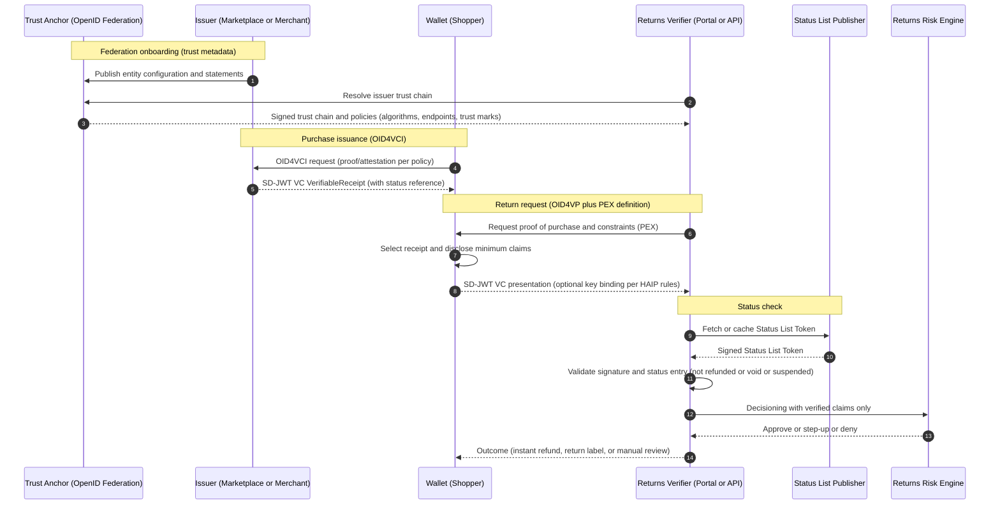
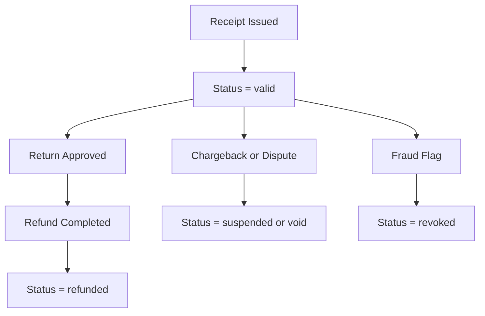
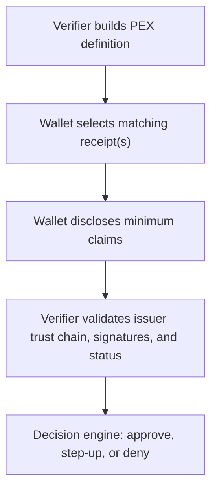

# Fraud-Resistant Returns for E-Commerce: Verifiable Receipts with SD-JWT VC + OpenID Federation + Status Lists + HAIP + Presentation Exchange

> **Quick Facts**
>
> | | |
> |---|---|
> | Industry | Retail / E-Commerce |
> | Complexity | Medium |
> | Key Packages | `SdJwt.Net.Vc`, `SdJwt.Net.StatusList`, `SdJwt.Net.OidFederation`, `SdJwt.Net.PresentationExchange` |
> | Sample | [RetailReturnsScenario.cs](../../samples/SdJwt.Net.Samples/RealWorld/RetailReturnsScenario.cs) |

## Why this use case (and why now)

Returns are now a board-level problem for retailers and marketplaces, not just a customer experience feature.

- The National Retail Federation (NRF) projects **$849.9B** in total retail returns in **2025**, and estimates **19.3% of online sales** will be returned. (NRF 2025 Returns Landscape)
- Appriss Retail research (with Deloitte) estimates **$103B** in losses from **return and claims fraud and abuse** in **2024**, with **15.14% of all returns** deemed fraudulent. (Appriss Retail 2024 Consumer Returns / Annual Research)

When fraud goes up, retailers tighten policies, and honest customers pay the tax: slower refunds, more friction, more manual reviews, and higher cost-to-serve.

This use case shows how to modernize returns without turning every return into a KYC event.

---

## The use case: "Verifiable Return Eligibility" for instant refunds (without oversharing)

### Goal

Enable a retailer or marketplace to:

- approve low-risk returns instantly,
- deny obvious return abuse early,
- keep honest customers frictionless,
- and provide audit-grade evidence for disputes.

### The core idea

Issue a **Verifiable Receipt Credential** (SD-JWT VC) at purchase time, then require the shopper to present only the minimum proof needed for the return.

Instead of: "Upload your order confirmation, email, and full identity details."  
You get: "Prove you bought this SKU, it is within the return window, and it has not already been refunded - without revealing anything else."

---

## Why advanced trust features are required (not optional)

A real returns ecosystem is multi-party:

- marketplace operator + many merchants
- carriers and logistics partners
- payment providers and chargebacks
- manufacturers and warranty providers
- stores, customer service, and returns hubs

Selective disclosure alone is not enough. Production requires four additional capabilities:

1. **Presentation Exchange (PEX)**: a structured way for verifiers to ask for the right proof, and wallets to satisfy it consistently.
2. **Status Lists**: revocation/suspension/status checks (cache/TTL dependent) so a "receipt" can be blocked after a refund, chargeback, or fraud update.
3. **OpenID Federation**: scalable trust onboarding (dynamic issuer discovery + trust chains) so every merchant does not require bespoke integration.
4. **HAIP**: a high-assurance profile that reduces interoperability ambiguity and raises security guarantees where needed.

---

## How sd-jwt-dotnet fits

The SD-JWT .NET ecosystem repository explicitly lists packages that match these needs:

- SD-JWT core + SD-JWT VC
- Status Lists
- OpenID4VCI (issuance) and OpenID4VP (presentations)
- Advanced: OpenID Federation, Presentation Exchange, and HAIP packages

See the README package table for:

- `SdJwt.Net`, `SdJwt.Net.Vc`, `SdJwt.Net.StatusList`
- `SdJwt.Net.Oid4Vci`, `SdJwt.Net.Oid4Vp`
- `SdJwt.Net.OidFederation`, `SdJwt.Net.PresentationExchange`, `SdJwt.Net.HAIP`

Note: OWF TAC marks the project as archived as of Feb 19, 2025, so production adoption should plan stewardship (fork/maintain) or coordinate reactivation. (Link in references)

---

## Reference architecture for e-commerce returns

### Actors

- **Issuer**: Marketplace or Merchant (issues receipt credential)
- **Holder**: Shopper (wallet in a retailer app or external wallet)
- **Verifier**: Returns service / in-store returns desk / customer support portal
- **Trust Anchor**: Marketplace federation operator (or industry federation operator)
- **Status List Publisher**: Marketplace returns/risk service (publishes credential status)

### Diagram 1: End-to-end return flow (Federation + OID4VCI/OID4VP + Status + HAIP + PEX)

---

## Credential design: VerifiableReceipt (SD-JWT VC)

A receipt credential should be designed for minimization and replay resistance.

### Suggested claims (illustrative)

- `vct`: "VerifiableReceipt"
- `iss`: issuer identifier (merchant/marketplace)
- `iat` / `exp`: issued/expiry (or validity)
- `order_id`: opaque order reference (not email)
- `item`: { `sku`, `variant`, `serial`? }
- `purchase_ts`: purchase timestamp
- `return_window_end`: timestamp
- `price_band`: e.g., A/B/C rather than exact amount (minimize)
- `store_channel`: online / store / pickup (optional)
- `payment_settled`: boolean or settlement reference (optional)
- `status`: status list reference (critical)
- `risk_tier`: low/medium/high (optional, for step-up policy)

### Selective disclosure strategy

Disclose only what the return needs:

- for "wrong size" apparel return: `order_id`, `sku`, `purchase_ts`, `return_window_end`
- for high-value electronics: add `serial` + key binding (holder binding)

Do NOT disclose:

- email, phone, address (unless delivery dispute)
- full payment instrument details
- full transaction history

---

## Status Lists: the anti-replay control that makes returns safe

A common fraud pattern is reusing the same proof-of-purchase multiple times or exploiting delayed reconciliation.

Status Lists provide numeric status values. Marketplace policy maps those values to business outcomes (for example `refunded` or `void`) and verifiers reject future use under that policy.
The lifecycle below is an illustrative business mapping on top of status-list values.

### Diagram 2: Status lifecycle

Practical note: SD-JWT VC explicitly specifies how `status` references work with the status_list mechanism, including that the Status List Token is a JWT when using that mechanism. Enforcement freshness depends on verifier cache/TTL configuration. (See SD-JWT VC + status-list references)

---

## OpenID Federation: scalable trust in a marketplace ecosystem

The operational bottleneck in marketplaces is onboarding: thousands of merchants and partners cannot be integrated by manual key exchange and paperwork alone.

OpenID Federation defines a trust model using:

- **Trust Anchors**
- signed **Entity Statements**
- resolved **trust chains**
- **metadata policies** (what algorithms and endpoints are acceptable)
- optional **trust marks** (signals like compliance or assurance)

In practice:

- The marketplace acts as the Trust Anchor (or delegates to an operator).
- Merchants join the federation with an entity configuration.
- The returns verifier resolves issuer metadata and policies dynamically.
- New merchants can be trusted without bespoke integration, provided they meet the federation policy.

This reduces fraud and operational burden while expanding ecosystem reach.

---

## HAIP: turning "works in our lab" into high-assurance interoperability

For normal apparel returns, basic selective disclosure is often enough.
For high-risk journeys (e.g., high-value electronics, suspicious patterns), you need a stricter profile.

HAIP is designed to select features and define requirements to enable interoperability among issuers, wallets, and verifiers where a high level of security and privacy is required. In this use case, HAIP-like constraints can drive:

- stronger holder binding (reduce replay and credential forwarding)
- wallet/verifier requirements (conformance baseline)
- crypto suite constraints
- consistent metadata and proof mechanisms

Pragmatic approach:

- Apply HAIP constraints only when risk tier demands it (step-up).
- Keep low-risk journeys frictionless.

---

## Presentation Exchange (PEX): how the verifier asks for "just enough proof"

Most return systems fail minimization because they cannot express what they need precisely. PEX provides that request language.

### Example PEX intent (human-readable)

"I need a VerifiableReceipt credential for this SKU and order_id, issued by a trusted merchant in our federation, with return_window_end not expired, and status not refunded/void. If value band is high, require serial number and key binding."

### Diagram 3: PEX selection and disclosure

---

## Business impact: what this changes in practice

### 1) Fraud reduction without punishing honest customers

- Fraudulent returns become harder because receipts are cryptographically verifiable and status-checked.
- Honest customers get faster refunds because proof is machine-verifiable.

### 2) Lower cost-to-serve in reverse logistics and customer support

- Fewer manual reviews triggered by missing/ambiguous evidence.
- Reduced need for agents to interpret screenshots and emails.

### 3) Better partner interoperability

- Federation reduces onboarding friction across merchants and partners.
- PEX provides a consistent "what to ask for" model across wallets.

### 4) Audit-grade evidence

- Store: the request definition, disclosed claims set (hash-bound), issuer chain evidence, status check evidence, and decision result.
- This supports dispute handling, chargebacks, and compliance review.

---

## Implementation checklist

- Define a stable `VerifiableReceipt` claim schema and disclosure policy.
- Require status checks for every refund decision path.
- Resolve trust dynamically using federation or a controlled issuer allow-list.
- Build PEX requests from return intent and risk tier.
- Apply step-up only for high-risk returns to keep low-risk journeys fast.
- Persist auditable verification receipts for disputes and fraud analytics.

---

## Public references (URLs)

Returns and fraud scale

- NRF 2025 Retail Returns Landscape: <https://nrf.com/research/2025-retail-returns-landscape>
- NRF press release (2025 returns): <https://nrf.com/media-center/press-releases/consumers-expected-to-return-nearly-850-billion-in-merchandise-in-2025>
- Appriss Retail annual research ($103B fraud in 2024): <https://apprissretail.com/news/appriss-retail-annual-research-fraudulent-returns-and-claims-cost-retailers-103b-in-2024/>

sd-jwt-dotnet ecosystem

- Repo: <https://github.com/openwallet-foundation-labs/sd-jwt-dotnet>
- OWF TAC status (archived): <https://tac.openwallet.foundation/projects/sd-jwt-dotnet/>

OpenID and IETF specs

- SD-JWT (RFC 9901): <https://www.rfc-editor.org/rfc/rfc9901.html>
- SD-JWT VC draft: <https://datatracker.ietf.org/doc/draft-ietf-oauth-sd-jwt-vc/>
- OAuth Status List draft: <https://datatracker.ietf.org/doc/draft-ietf-oauth-status-list/>
- OpenID4VP 1.0 (Final): <https://openid.net/specs/openid-4-verifiable-presentations-1_0.html>
- OpenID Federation 1.0 (Final): <https://openid.net/specs/openid-federation-1_0.html>
- OpenID Federation 1.0 approval notice (Feb 17, 2026): <https://openid.net/openid-federation-1-0-final-specification-approved/>
- OpenID4VC HAIP 1.0: <https://openid.net/specs/openid4vc-high-assurance-interoperability-profile-1_0.html>
- DIF Presentation Exchange v2.1.1: <https://identity.foundation/presentation-exchange/spec/v2.1.1/>

---

## Related Use Cases

| Use Case | Relationship |
|----------|-------------|
| [Telecom eSIM](telco-esim.md) | Similar - fraud-resistant multi-party verification |
| [Automated Compliance](automated-compliance.md) | Foundation - policy-driven disclosure patterns |
| [Incident Response](incident-response.md) | Complementary - fraud event handling workflows |

---

_Disclaimer: This article is informational and not legal advice. For regulated deployments, validate obligations with your legal/compliance teams and the latest official guidance._
