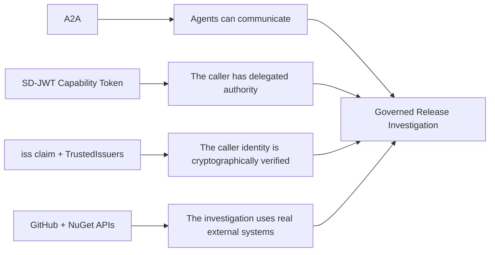
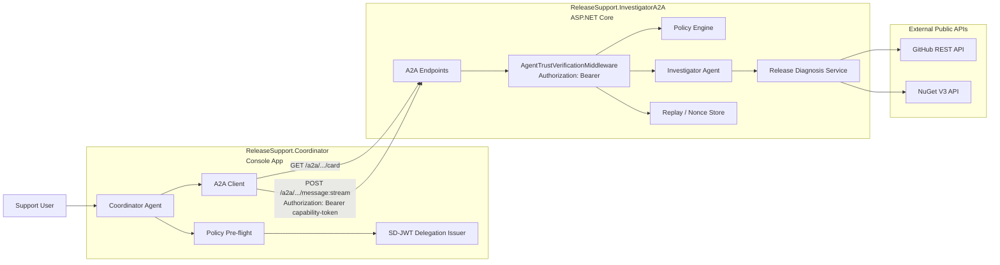
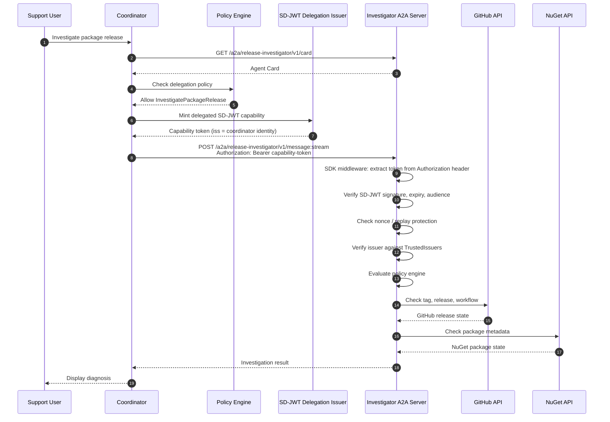
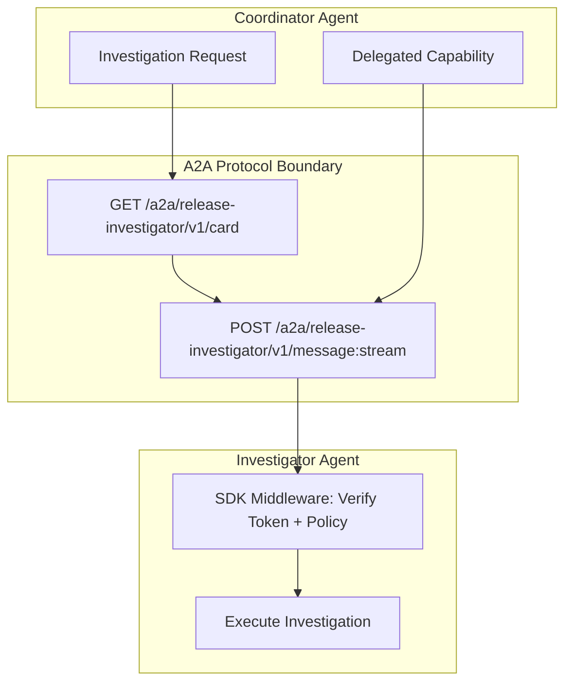
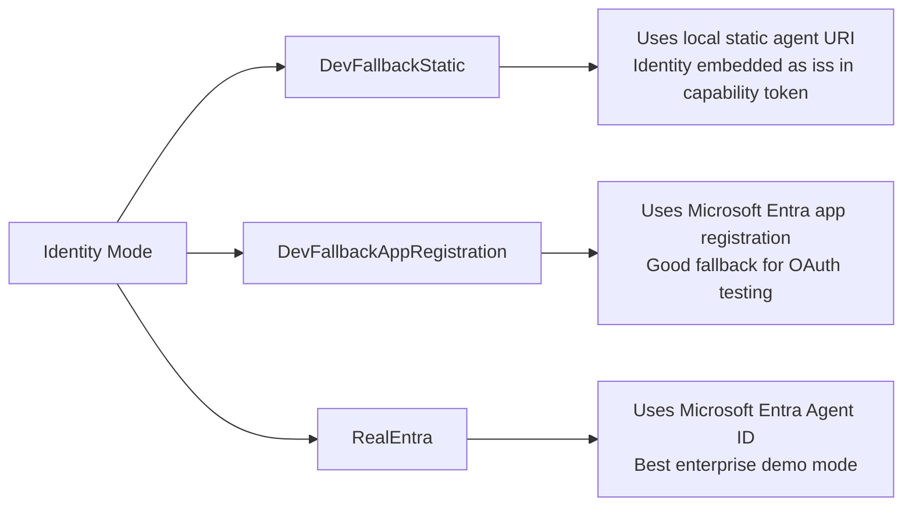
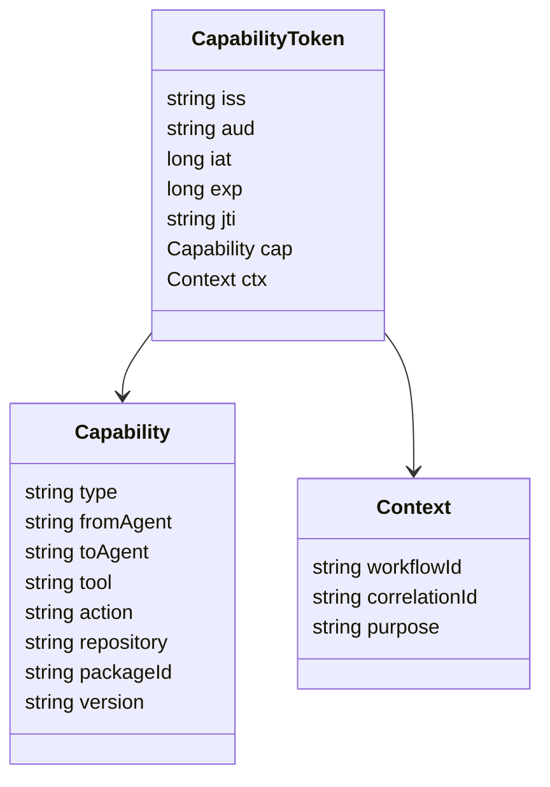
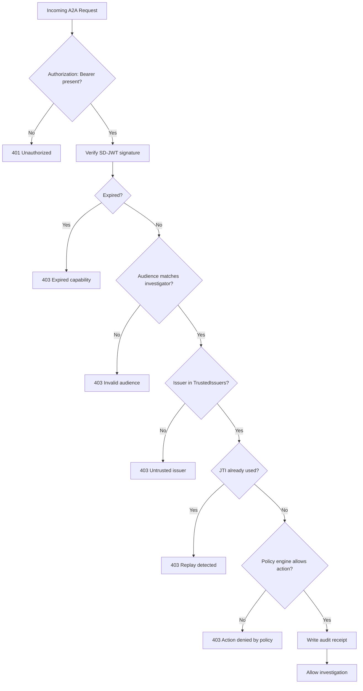
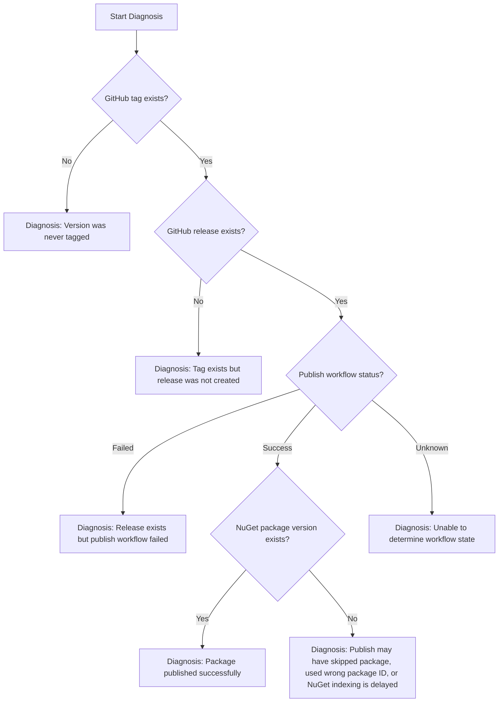
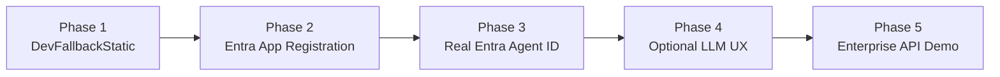

# Trusted Release Support A2A Demo

Demonstrates governed agent-to-agent (A2A) delegation using SD-JWT capability
tokens from the `SdJwt.Net.AgentTrust` packages.

A **Coordinator** agent delegates a scoped investigation capability to an
**Investigator** agent, which queries real GitHub and NuGet APIs to diagnose
NuGet release pipeline issues.

This sample complements the MCP Tool Governance demo:

- **MCP Tool Governance**: protects agent-to-tool calls.
- **Trusted Release Support A2A**: protects agent-to-agent delegation.

## What This Demo Proves



The core message is:

> A2A lets agents communicate.
> The SD-JWT capability token carries both identity (`iss` claim) and delegated
> authority (`cap` claim) in a single signed artefact.
> The server verifies both using the SDK's `AgentTrustVerificationMiddleware`.

---

## Architecture



---

## End-to-End Flow



---

## A2A Boundary



The A2A request carries a single security artefact:

```http
Authorization: Bearer <sd-jwt-capability-token>
```

The capability token carries both identity and authority:

- **`iss` claim** answers: Which agent is calling?
- **`cap` claim** answers: What is this agent allowed to delegate right now?

The server verifies the token using the SDK's `AgentTrustVerificationMiddleware`,
which reads `Authorization: Bearer` by default, matching the RFC 6750 bearer
token scheme.

---

## Projects

| Project                          | Description                                        |
| -------------------------------- | -------------------------------------------------- |
| `ReleaseSupport.Shared`          | Constants, DTOs, A2A message models                |
| `ReleaseSupport.InvestigatorA2A` | ASP.NET Core A2A server using SDK middleware       |
| `ReleaseSupport.Coordinator`     | Console client that orchestrates the investigation |

---

## Running

### Prerequisites

- .NET 9.0+ SDK
- No paid cloud services required
- Public internet access for GitHub and NuGet APIs

The default mode uses `DevFallbackStatic`, so the demo can run locally without
Microsoft Entra setup.

---

### Step 1: Start the Investigator Server

```bash
cd samples/EntraA2AReleaseSupportDemo/ReleaseSupport.InvestigatorA2A
dotnet run
```

The server starts on:

```text
http://localhost:5052
```

The A2A endpoints are:

```http
GET  http://localhost:5052/a2a/release-investigator/v1/card
POST http://localhost:5052/a2a/release-investigator/v1/message:stream
```

---

### Step 2: Run the Coordinator

In a separate terminal:

```bash
cd samples/EntraA2AReleaseSupportDemo/ReleaseSupport.Coordinator
```

Happy path:

```bash
dotnet run -- \
  --repo openwallet-foundation-labs/sd-jwt-dotnet \
  --package SdJwt.Net \
  --version 1.0.1 \
  --action InvestigatePackageRelease
```

Blocked path:

```bash
dotnet run -- \
  --repo openwallet-foundation-labs/sd-jwt-dotnet \
  --package SdJwt.Net \
  --version 1.0.1 \
  --action RerunWorkflow
```

---

## CLI Arguments

| Argument             | Default                                    | Description                                  |
| -------------------- | ------------------------------------------ | -------------------------------------------- |
| `--repo`             | `openwallet-foundation-labs/sd-jwt-dotnet` | GitHub repository in `owner/name` format     |
| `--package`          | `SdJwt.Net`                                | NuGet package ID                             |
| `--version`          | `1.0.1`                                    | Version to investigate                       |
| `--action`           | `InvestigatePackageRelease`                | Tool action to request                       |
| `--identity-mode`    | `DevFallbackStatic`                        | Identity mode (for future Entra integration) |
| `--investigator-url` | `http://localhost:5052`                    | Investigator base URL                        |

---

## Identity Modes



| Mode                         | Description                                                                        | Requirements                          |
| ---------------------------- | ---------------------------------------------------------------------------------- | ------------------------------------- |
| `DevFallbackStatic`          | Coordinator identity is a static agent URI, embedded as the capability token `iss` | None                                  |
| `DevFallbackAppRegistration` | Uses a Microsoft Entra app registration                                            | Entra app registration                |
| `RealEntra`                  | Uses Microsoft Entra Agent ID                                                      | Tenant support and required licensing |

> `DevFallbackStatic` is for local development only. It demonstrates the protocol
> and capability model, not real enterprise identity.

---

## Capability Token Model

The Coordinator mints a short-lived delegated capability before calling the
Investigator.



Example capability payload:

```json
{
  "iss": "agent://entra/dev-local/release-support-coordinator-dev",
  "aud": "agent://entra/dev-local/release-investigator-dev",
  "iat": 1778370000,
  "exp": 1778370300,
  "jti": "cap-a2a-7f2a3e",
  "cap": {
    "type": "agent-delegation",
    "fromAgent": "release-support-coordinator-dev",
    "toAgent": "release-investigator-dev",
    "tool": "release-investigation",
    "action": "InvestigatePackageRelease",
    "repository": "openwallet-foundation-labs/sd-jwt-dotnet",
    "packageId": "SdJwt.Net",
    "version": "1.0.1"
  },
  "ctx": {
    "workflowId": "release-support",
    "correlationId": "corr-123456",
    "purpose": "agent-delegation"
  }
}
```

---

## Server-Side Validation

The server uses the SDK's `AgentTrustVerificationMiddleware` which performs
all validation automatically. The middleware is configured via
`AddAgentTrustVerification()` and `UseAgentTrustVerification()`.



---

## Demo Scenarios

### Scenario 1: Happy Path -- Published Package

```bash
dotnet run -- --version 1.0.1 --action InvestigatePackageRelease
```

Expected:

```text
Tag found.
Release found.
NuGet package found.
Diagnosis: Package published successfully.
```

---

### Scenario 2: Happy Path -- Unreleased Version

```bash
dotnet run -- --version 99.0.0 --action InvestigatePackageRelease
```

Expected:

```text
Tag not found.
Diagnosis: Version was never tagged.
```

---

### Scenario 3: Blocked Path -- Denied Action

```bash
dotnet run -- --action RerunWorkflow
```

Expected:

```text
Policy engine blocks delegation at step 2.
No A2A request is sent.
```

---

### Scenario 4: Blocked Path -- Capability Tampering

Capability says:

```text
version = 1.0.1
```

Request asks:

```text
version = 2.0.0
```

Expected:

```text
Investigator rejects the request.
Reason: Capability resource does not match requested resource.
```

---

### Scenario 5: Blocked Path -- Replay

The same SD-JWT capability token is reused.

Expected:

```text
Investigator rejects the request.
Reason: Capability token has already been used.
```

---

## Diagnosis Rules



---

## Security Properties

| Property               | Implementation                                                           |
| ---------------------- | ------------------------------------------------------------------------ |
| Scoped delegation      | Capability token contains tool, action, repository, package, and version |
| Time-limited tokens    | 5-minute default lifetime                                                |
| Replay prevention      | Nonce store tracks used token IDs                                        |
| Cryptographic identity | `iss` claim verified against `TrustedIssuers` signing keys               |
| Policy enforcement     | Client-side pre-flight and server-side middleware evaluation             |
| Resource binding       | Request repo/package/version must match the capability                   |
| Deny-by-default        | Unsupported actions are rejected before delegation                       |
| Audit receipts         | SDK middleware emits receipts for every decision                         |

---

## Trust Boundary Summary

```mermaid
flowchart LR
    subgraph Local["Coordinator Trust Boundary"]
        UserInput[User Input]
        Policy[Policy Decision]
        Capability[Capability Minting<br/>iss = coordinator identity]
    end

    subgraph Network["A2A Network Boundary"]
        SDJWT[Authorization: Bearer<br/>SD-JWT Capability Token]
    end

    subgraph Remote["Investigator Trust Boundary"]
        SDKMiddleware[SDK AgentTrustVerificationMiddleware]
        VerifyToken[Verify signature + expiry + audience]
        VerifyIssuer[Verify iss against TrustedIssuers]
        EvalPolicy[Evaluate policy engine]
        Execute[Execute External API Calls]
    end

    UserInput --> Policy
    Policy --> Capability
    Capability --> SDJWT
    SDJWT --> SDKMiddleware
    SDKMiddleware --> VerifyToken
    VerifyToken --> VerifyIssuer
    VerifyIssuer --> EvalPolicy
    EvalPolicy --> Execute
```



---

## Packages Used

| Package                              | Purpose                                                                    |
| ------------------------------------ | -------------------------------------------------------------------------- |
| `SdJwt.Net.AgentTrust.Core`          | Token minting, verification, nonce store                                   |
| `SdJwt.Net.AgentTrust.Policy`        | Rule-based policy engine                                                   |
| `SdJwt.Net.AgentTrust.A2A`           | Delegation issuer with policy pre-flight                                   |
| `SdJwt.Net.AgentTrust.AspNetCore`    | SDK middleware (`AddAgentTrustVerification` / `UseAgentTrustVerification`) |
| `SdJwt.Net.AgentTrust.OpenTelemetry` | Tracing and metrics                                                        |

---

## Recommended Next Steps



1. Start with `DevFallbackStatic` so the sample is easy to run.
2. Add `DevFallbackAppRegistration` to demonstrate real OAuth token validation.
3. Add `RealEntra` to demonstrate Microsoft Entra Agent ID.
4. Add optional LLM support for natural-language investigation requests.
5. Extend the same pattern to real enterprise tools such as ServiceNow, D365, Salesforce, APIM, or Azure Monitor.
