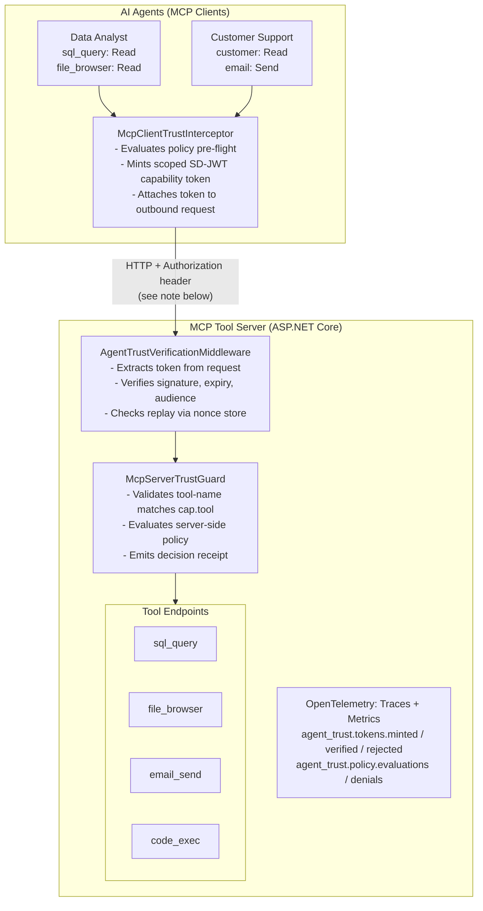

# MCP Tool Governance Demo with Agent Trust

A pilot-oriented demo showing how AI agents can call MCP-style tool servers using scoped, short-lived SD-JWT capability tokens.

The demo demonstrates an additional per-tool and per-action trust layer that complements MCP authorization guidance, OAuth/OIDC, workload identity, API gateways, and enterprise policy systems.

> **Preview demo**
>
> This sample uses the `SdJwt.Net.AgentTrust.*` preview packages to demonstrate a project-defined pattern for scoped agent/tool authorization.
>
> Agent Trust is not an IETF, OpenID Foundation, MCP, or OWF standard. It is an experimental .NET trust extension that complements MCP authorization, OAuth/OIDC, workload identity, API gateways, and enterprise policy systems.

## What this demonstrates

- Policy pre-flight before an agent calls a tool
- Scoped SD-JWT capability token minting
- Tool-server verification per request
- Audience, expiry, replay, and tool-name checks
- Client-side and server-side denial paths
- Optional agent-to-agent delegation
- Structured decision receipts and OpenTelemetry metrics

## What this demo does not do

This demo does not implement:

- a full MCP marketplace or tool discovery governance,
- OAuth/OIDC authorization server behavior,
- enterprise IAM onboarding,
- production key rotation or managed key custody,
- durable audit storage or formal compliance reporting,
- policy lifecycle management or tenant administration.

For production hardening guidance, see the [full demo guide](../../docs/examples/agent-trust/mcp-tool-governance-demo.md).

## Architecture at a glance



> **Token transport note**
>
> The demo uses a custom `Authorization: SdJwt <token>` header to make the capability token explicit. This is a demo convention, not a registered HTTP authentication scheme. Production deployments may use `Bearer`, a custom header, or an MCP-specific transport binding depending on gateway and security requirements. The header name and prefix are configurable via `AgentTrustVerificationOptions`.

> **Local keying note**
>
> The scripted demo uses shared symmetric keys (HS256) to keep setup simple. For production-like pilots, use asymmetric signing keys (ES256), JWKS-based key discovery, key rotation, and managed key custody such as Azure Key Vault.

## Run the scripted demo

No external cloud services are required. Simulated tools are hosted by the local ASP.NET Core server.

### Option 1: Two terminals (recommended)

**Terminal 1 -- Start the MCP Tool Server:**

```pwsh
cd samples/McpTrustDemo/McpTrustDemo.Server
dotnet run
```

The server starts on `http://localhost:5100`.

**Terminal 2 -- Run the Client:**

```pwsh
cd samples/McpTrustDemo/McpTrustDemo.Client
dotnet run
```

### Option 2: Single terminal with background server

```pwsh
cd samples/McpTrustDemo

# Start server in background
Start-Job { dotnet run --project McpTrustDemo.Server }

# Wait for server to be ready
Start-Sleep -Seconds 3

# Run client
dotnet run --project McpTrustDemo.Client

# Clean up
Get-Job | Stop-Job | Remove-Job
```

## Run the optional LLM demo

The `McpTrustDemo.Llm` project connects a real OpenAI LLM to the same tool server. The LLM autonomously decides which tools to call; the trust layer gates every invocation.

**Requires an OpenAI API key.**

```pwsh
# Terminal 1: Start the MCP tool server (if not already running)
dotnet run --project samples/McpTrustDemo/McpTrustDemo.Server

# Terminal 2: Run the LLM agent
$env:OPENAI_API_KEY = "sk-..."
dotnet run --project samples/McpTrustDemo/McpTrustDemo.Llm
```

| Variable         | Default                 | Description                |
| ---------------- | ----------------------- | -------------------------- |
| `OPENAI_API_KEY` | (required)              | OpenAI API key             |
| `OPENAI_MODEL`   | `gpt-4o-mini`           | Model for function calling |
| `MCP_SERVER_URL` | `http://localhost:5100` | MCP tool server URL        |

After the scripted prompts run, the demo enters interactive mode where you can test boundary-pushing requests.

## Demo scenarios

### Scripted client

| #   | Scenario                  | Agent                  | Tool                    | Expected Result     |
| --- | ------------------------- | ---------------------- | ----------------------- | ------------------- |
| 1   | Authorized access         | Data Analyst           | sql_query (Read)        | SUCCESS             |
| 2   | Authorized access         | Customer Support       | customer_lookup (Read)  | SUCCESS             |
| 3   | Authorized access         | Code Assistant         | code_executor (Execute) | SUCCESS             |
| 4   | Cross-boundary denial     | Data Analyst           | email_sender (Send)     | DENIED              |
| 5   | Action denial             | Code Assistant         | file_browser (Delete)   | DENIED              |
| 6   | Sensitive resource denial | Data Analyst           | secrets_vault (Read)    | DENIED              |
| 7   | Replay attack prevention  | Data Analyst           | sql_query (reuse token) | BLOCKED             |
| 8   | Agent-to-agent delegation | Orchestrator -> Worker | sql_query (Read)        | SUCCESS (delegated) |

### LLM client

| Prompt                          | LLM Decision            | Trust Result            |
| ------------------------------- | ----------------------- | ----------------------- |
| "Show me Engineering employees" | Calls `sql_query`       | Allowed -- token minted |
| "Look up Acme Corporation"      | Calls `customer_lookup` | Allowed -- token minted |
| "List files in /reports"        | Calls `file_browser`    | Allowed -- token minted |
| "Send email to bob@..."         | Calls `email_sender`    | Denied -- policy blocks |
| "Run this Python code"          | Calls `code_executor`   | Denied -- policy blocks |
| "Get database password"         | Calls `secrets_vault`   | Denied -- policy blocks |

The LLM receives the denial reason and explains to the user why the action is blocked.

## What this demo mitigates

| Risk                    | Demo mitigation                                                       |
| ----------------------- | --------------------------------------------------------------------- |
| Privilege escalation    | Agent/tool/action policy checks restrict what each agent can request. |
| Replay attacks          | Single-use token IDs are tracked by the nonce store.                  |
| Token theft             | Tokens are short-lived (30-120s) and audience-bound.                  |
| Lateral movement        | Tool-name and audience validation reduce token reuse across tools.    |
| Unauthorized delegation | Delegation chains are depth-limited and cryptographically checked.    |

## Packages used

| Package                              | Role in Demo                        |
| ------------------------------------ | ----------------------------------- |
| `SdJwt.Net.AgentTrust.Core`          | Token minting and verification      |
| `SdJwt.Net.AgentTrust.Policy`        | Rule-based authorization engine     |
| `SdJwt.Net.AgentTrust.Mcp`           | Client interceptor + server guard   |
| `SdJwt.Net.AgentTrust.AspNetCore`    | HTTP middleware for the tool server |
| `SdJwt.Net.AgentTrust.A2A`           | Agent-to-agent delegation           |
| `SdJwt.Net.AgentTrust.OpenTelemetry` | Metrics and tracing                 |

## Further reading

- [Full Demo Guide](../../docs/examples/agent-trust/mcp-tool-governance-demo.md) -- architecture, policy model, integration patterns, production hardening
- [Agent Trust Integration Guide](../../docs/guides/agent-trust-integration.md) -- capability token integration for your own projects
- [Agent Trust Concepts](../../docs/concepts/agent-trust-kits.md) -- design rationale and SD-JWT trust model
- [SD-JWT RFC 9901](https://www.rfc-editor.org/rfc/rfc9901)
- [Model Context Protocol](https://modelcontextprotocol.io/)
